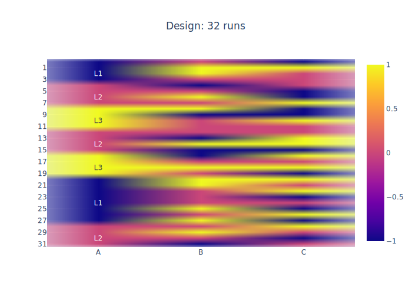
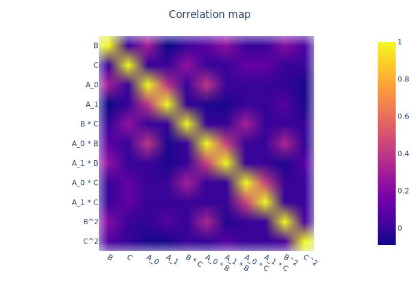
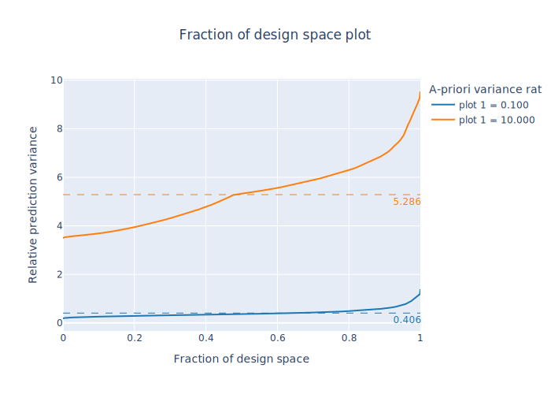
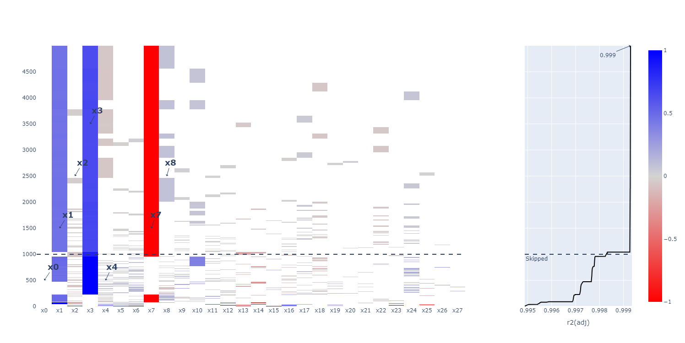

# PyOptEx

| | |
| --- | --- |
| Package | [](https://pypi.org/project/pyoptex/) [](https://pypi.org/project/pyoptex/) [](https://github.com/mborn1/pyoptex/actions/workflows/test-pr.yml/badge.svg)|
| Meta | [](https://github.com/mborn1/pyoptex/blob/main/LICENSE) [](https://pyoptex.readthedocs.io/en/latest/) |


PyOptEx (or Python Optimal Experiments) is a package designed to create optimal design of experiments with Python. It is fully open source and can be used for any purpose.

The package is designed for both engineers, and design of experiment researchers. Engineers can use the precreated functions to generate designs for their problems,
especially the cost-optimal algorithms. Researchers can easily develop new metrics (criteria) and test them.

<p align="center">
  
</p>

To generate experimental designs, there are two main options:

* **Fixed structure**: These designs have a fixed number of runs and fixed randomization
  structure, known upfront. Well-known designs include split-plot, strip-plot, and 
  regular staggered-level designs. A specialization is also included for splitk-plot
  designs using the update formulas as described in 
  [Born and Goos (2025)](https://www.sciencedirect.com/science/article/pii/S0167947324001129).

* **Cost-optimal designs**: These design generation algorithms follow a new 
  DoE philosophy. 
  Instead of fixing the number of runs and randomization structure, the algorithm 
  optimizes directly based on the underlying resource constraints. The user must only 
  specify a budget and a function which computes the resource consumption of a design. 
  Go to Creating a cost-optimal design for an example. The currently implemented 
  algorithm is CODEX.

## Main features

* The **first complete Python package for optimal design of experiments**. Model
  [everything](https://pyoptex.readthedocs.io/en/latest/_docs/doe/example_scenarios.html#example-scenarios) including continuous factors, categorical factors, 
  mixtures, blocked experiments, split-plot experiments, staggered-level experiments.

* **Intuitive design of experiments** with 
  [cost-optimal designs](https://pyoptex.readthedocs.io/en/latest/_docs/doe/quickstart.html#qc-cost) 
  for everyone. No longer requires expert statistical knowledge before creating
  experiments.

* Accounts for **any constraint** you require. Not only can you choose 
  the randomization structure 
  [manually](https://pyoptex.readthedocs.io/en/latest/_docs/doe/quickstart.html#qc-other-fixed), 
  or let the 
  [cost-optimal](https://pyoptex.readthedocs.io/en/latest/_docs/doe/quickstart.html#qc-cost) 
  design algorithms figure it out automatically, you can also specify the physically 
  possible factor combinations for a run.

* **Augmenting** designs was never easier. Simply read your initial design 
  to a pandas dataframe and augment it by passing it as a 
  [prior](https://pyoptex.readthedocs.io/en/latest/_docs/doe/customization.html#cust-augment).

* **Customize** any part of the algorithm, including the 
  [optimization criteria](https://pyoptex.readthedocs.io/en/latest/_docs/doe/customization.html#cust-metric) (metrics), 
  [linear model](https://pyoptex.readthedocs.io/en/latest/_docs/doe/customization.html#cust-model), 
  [encoding of the categorical factors](https://pyoptex.readthedocs.io/en/latest/_docs/doe/customization.html#cust-cat-encoding), 
  and much more.

* Directly optimize for **Bayesian** 
  [a-priori variance ratios](https://pyoptex.readthedocs.io/en/latest/_docs/doe/customization.html#cust-bayesian-ratio)
  in designs with hard-to-change factors.

* High-performance **model selection** using 
  [SAMS](https://pyoptex.readthedocs.io/en/latest/_docs/analysis/customization.html#a-cust-sams)
   (simulated annealing model selection)
  [(Wolters and Bingham, 2012)](https://www.tandfonline.com/doi/abs/10.1198/TECH.2011.08157).

## Getting started

Install this package using pip:

```bash
pip install pyoptex
```

### Create your first design

For a complete step-by-step walkthrough, see the documentation on
[Your first design](https://pyoptex.readthedocs.io/en/latest/_docs/doe/quickstart.html).
Here is a quick example that generates a D-optimal design with 20 runs:

```python
from pyoptex._seed import set_seed
from pyoptex.doe.fixed_structure import (
    Factor, create_fixed_structure_design, create_parameters, default_fn,
)
from pyoptex.doe.fixed_structure.metric import Dopt
from pyoptex.utils.model import model2Y2X, partial_rsm_names

set_seed(42)

factors = [
    Factor("A", type="categorical", levels=["L1", "L2", "L3"]),
    Factor("B", type="continuous"),
    Factor("C", type="continuous", min=2, max=5),
]
model = partial_rsm_names({"A": "tfi", "B": "quad", "C": "quad"})
Y2X = model2Y2X(model, factors)

fn = default_fn(factors, Dopt(), Y2X)
params = create_parameters(factors, fn, 20)
Y, state = create_fixed_structure_design(params, n_tries=10)
print(Y)
```

The generated design can be visualized as a heatmap and its model correlations
can be inspected:

<p align="center">
  
  
</p>

### Cost-optimal design with CODEX

Instead of fixing the number of runs upfront, let the algorithm optimize
within a resource budget:

```python
from pyoptex._seed import set_seed
from pyoptex.doe.cost_optimal import Factor
from pyoptex.doe.cost_optimal.codex import (
    create_cost_optimal_codex_design, create_parameters, default_fn,
)
from pyoptex.doe.cost_optimal.cost import parallel_worker_cost
from pyoptex.doe.cost_optimal.metric import Iopt
from pyoptex.utils.model import model2Y2X, partial_rsm_names

set_seed(42)

factors = [
    Factor("A", type="categorical", levels=["L1", "L2", "L3", "L4"]),
    Factor("E", type="continuous", grouped=False),
    Factor("F", type="continuous", grouped=False, min=2, max=5),
    Factor("G", type="continuous", grouped=False),
]
model = partial_rsm_names({"A": "tfi", "E": "quad", "F": "quad", "G": "quad"})
Y2X = model2Y2X(model, factors)

cost_fn = parallel_worker_cost(
    {"A": 120, "E": 1, "F": 1, "G": 1}, factors, 720, 5
)

nsims = 10
fn = default_fn(nsims, factors, cost_fn, Iopt(), Y2X)
params = create_parameters(factors, fn)
Y, state = create_cost_optimal_codex_design(params, nsims=nsims, nreps=1)

print(f"Runs: {len(state.Y)}, Cost: {state.cost_Y}")
print(Y)
```

### Evaluate your design

Designs can be evaluated with diagnostics such as the fraction of design space
(FDS) plot, which shows the prediction variance across the design space:

<p align="center">
  
</p>

### Analyze your first dataset

For a complete guide to model fitting after running your experiment, see the
documentation on
[Your first dataset](https://pyoptex.readthedocs.io/en/latest/_docs/analysis/quickstart.html).

PyOptEx includes SAMS (simulated annealing model selection) for automatic
model selection. The raster plot below visualizes the explored models: each
row is a candidate model, each column a term, and the color indicates the
coefficient magnitude.

<p align="center">
  
</p>

See the full [documentation](https://pyoptex.readthedocs.io/en/latest/) for
more examples, including split-plot designs, mixtures, constraints, and
design augmentation.

## Citation

If you use PyOptEx in academic work, please cite the software and/or the
accompanying paper:

> Born, M., & Goos, P. (2025). Optimal split^k-plot designs.
> *Computational Statistics & Data Analysis*.
> [doi:10.1016/j.csda.2024.108074](https://doi.org/10.1016/j.csda.2024.108074)

A machine-readable citation file is available: [`CITATION.cff`](CITATION.cff).

## License

BSD-3 clause, meaning you can use and alter it for any purpose,
open-source or commercial!
However, any open-source contributions to this project are much
appreciated by the community.

## Contributing

See [`CONTRIBUTING.md`](CONTRIBUTING.md) for development setup and guidelines.

Ideas, bugs and feature requests can be added as an
[issue](https://github.com/mborn1/pyoptex/issues).
Direct code contributions are welcome via pull requests.
